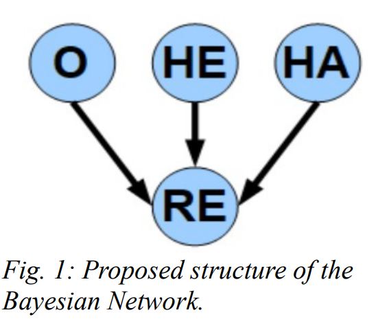
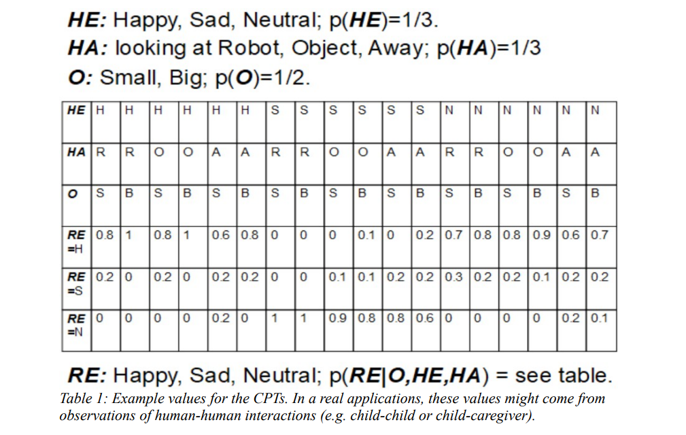

# Human Robot Simulation

The objective of this project is to create a ROS package that simulates a computational model of human-robot interaction.

### Steps:
* Unzip the folder into your catkin workspace to run this project.
* Now make the python scripts executable by navigating into the "catkin_ws/src/cr_week8_test/scripts" directory. After this run the following command mentioned below into the terminal. * represents every file present in the directory. Run the command for all 4 scripts in the terminal.
    * chmod +x *.py
* After this execute the following steps:
    * cd ~/catkin_ws/
    * catkin_make
    * source devel/setup.bash
* Now the project can be started. In a new terminal run the following command and keep it running:
    * roscore
* Run the following command in a new terminal. This command will launch the rospackage.
    * roslaunch cr_week8_test human_robot_interaction.launch
* You can now see the estimation done by the robot of the scene it is capturing.

## Description
Consider a social humanoid robot sitting at a table in front of a human child. At each interaction, a different colored toy is placed on the able, and the robot should express one emotion, which depends on both the perceived object properties and the perceived child behavior. This can be modeled with a Bayesian Network (see Fig. 1 below). The robot can perceive the size of the object (O), and classify it as either: small, big (they are all equally likely to happen). The robot can perceive human facial expressions (HE), and classify them as either: happy, sad, neutral (they are all equally likely to happen). The robot can perceive human head and eyes movements (actions, HA), and classify them as either: looking at the robot face, looking at the colored toy, looking away (they are all equally likely to happen). The robot face can express three possible emotions (RE): happy, sad, neutral. Note that, during an interaction, the robot might not have access to all the variables (object size, human expression, human action), due to e.g. absence of one of the stimuli or failure of a sensor, but still the robot has to decide what emotion expression is the most likely to be appropriate.

The expression prediction is realized with Bayesian Network shown above and the Conditional Probability Table (CPT) which can be observed below.

